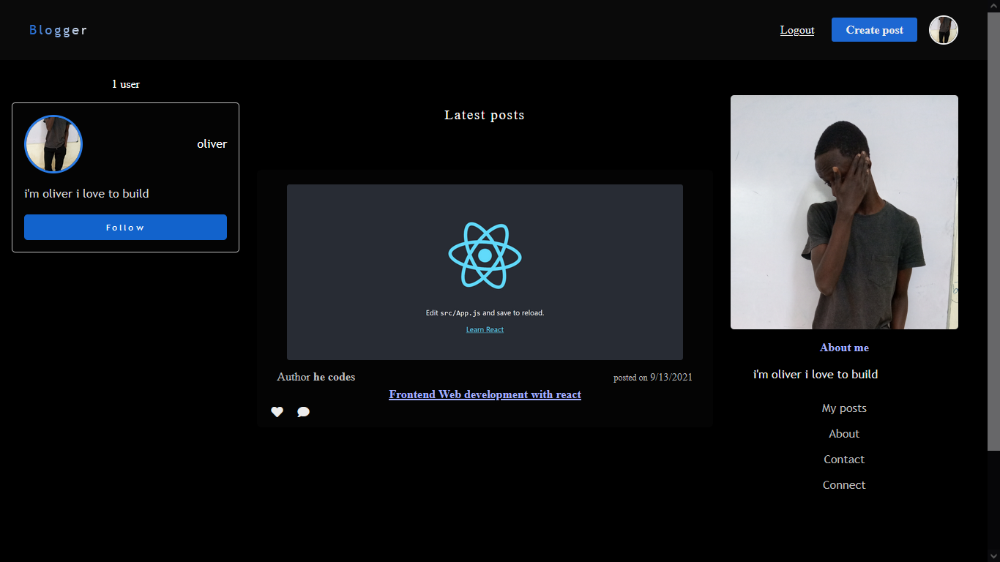

## Blog website


[Live Demo](https://oliverblogger.herokuapp.com/)

### description

this a simple blog website built with express js ejs and css

### features

- session based authentication with express-session
- files upload with multer
- serverside user input validation with express validator
- a middleware to protect routes a user can only visit the create post page if they are logged in.

### getting started

clone this repository into your machine.
open the project with your code editor.
on the terminal run the following command

to install all the dependancies

```npm
run npm install
```

to configuring the mongodb

```
create a .dotenv file where
MONGO_URL = `your mongo url`
```

to start the local development server.

```
run command npm run devStart
```

enjoy 🎉
